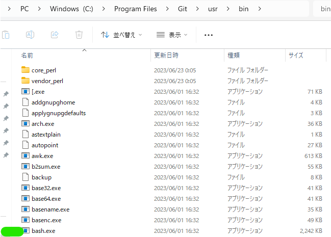

## 前提
* ShellScriptの練習の意味が強いので、今回のshについては、マネコンでの操作のほうが速いです
* GitBashから実行しています
* bash自体はusrディレクトリにあります<br>
 <br>
* 完全なLinux環境ではないので、AWS CLIのコマンド内に`/dev/xvda`と入れると勝手に`C:\Program Files\Git\dev\xdva`と変換され、不正なコマンドであるとエラーが返ってきます。なのでボリュームのアタッチはいったん保留にしました。やるならWSLなど、きっちりLinux環境を構築してから実行することがいいと思います
* 参考記事）
  * https://zenn.dev/yish/articles/f1689985ebf645


## ShellScriptの説明とある程度の実行順
* インスタンスの状態確認
[ec2instance_search.sh](ec2instance_search.sh)
  * ブロックデバイスがデタッチ状態
  ```bash
  ブロックデバイスの情報取得
  {
      "Volumes": [
          {
              "Attachments": [],
              "AvailabilityZone": "ap-northeast-1c",
              "CreateTime": "2024-01-07T21:56:38.737Z",
              "Encrypted": false,
              "Size": 8,
              "SnapshotId": "snap-0385655bde22c170f",
              "State": "available",
              "VolumeId": "vol-0df7d8233e03ef2c1",
              "Iops": 100,
              "VolumeType": "gp2",
              "MultiAttachEnabled": false
          }
      ]
  }
  インスタンスの情報取得
  [
      [
          {
              "InstanceId": "i-020539a26cbe1061f",
              "InstanceState": "stopped",
              "PublicIPv4": null,
              "KeyName": "Kawasaki1002",
              "BlockDeviceMappings": [],
              "RootDeviceName": "/dev/xvda",
              "Tags": [
                  {
                      "Key": "Name",
                      "Value": "20240105-terraform-stage"
                  }
              ]
          }
      ]
  ]
  ```
  * ブロックデバイスがアタッチ状態
  ```bash
  {
      "Volumes": [
          {
              "Attachments": [
                  {
                      "AttachTime": "2024-01-14T04:58:39.000Z",
                      "Device": "/dev/xvda",
                      "InstanceId": "i-020539a26cbe1061f",
                      "State": "attached",
                      "VolumeId": "vol-0df7d8233e03ef2c1",
                      "DeleteOnTermination": false
                  }
              ],
              "AvailabilityZone": "ap-northeast-1c",
              "CreateTime": "2024-01-07T21:56:38.737Z",
              "Encrypted": false,
              "Size": 8,
              "SnapshotId": "snap-0385655bde22c170f",
              "State": "in-use",
              "VolumeId": "vol-0df7d8233e03ef2c1",
              "Iops": 100,
              "VolumeType": "gp2",
              "MultiAttachEnabled": false
          }
      ]
  }
  ```

* ブロックデバイスの情報取得
ここは短いのでShellなしでもいいかなと思いました。
```bash
$ aws ec2 describe-volumes
```
  * ブロックデバイスがデタッチ状態
  ```bash
  {
      "Volumes": [
          {
              "Attachments": [],
              "AvailabilityZone": "ap-northeast-1c",
              "CreateTime": "2024-01-07T21:56:38.737Z",
              "Encrypted": false,
              "Size": 8,
              "SnapshotId": "snap-0385655bde22c170f",
              "State": "available",
              "VolumeId": "vol-0df7d8233e03ef2c1",
              "Iops": 100,
              "VolumeType": "gp2",
              "MultiAttachEnabled": false
          }
      ]
  }
  ```
  * ブロックデバイスがアタッチ状態
  ```bash
  {
      "Volumes": [
          {
              "Attachments": [
                  {
                      "AttachTime": "2024-01-14T06:12:13.000Z",
                      "Device": "/dev/xvda",
                      "InstanceId": "i-020539a26cbe1061f",
                      "State": "attached",
                      "VolumeId": "vol-0df7d8233e03ef2c1",
                      "DeleteOnTermination": false
                  }
              ],
              "AvailabilityZone": "ap-northeast-1c",
              "CreateTime": "2024-01-07T21:56:38.737Z",
              "Encrypted": false,
              "Size": 8,
              "SnapshotId": "snap-0385655bde22c170f",
              "State": "in-use",
              "VolumeId": "vol-0df7d8233e03ef2c1",
              "Iops": 100,
              "VolumeType": "gp2",
              "MultiAttachEnabled": false
          }
      ]
  }
  ```


* ブロックデバイスのアタッチ（アタッチされていなければ）
[ec2volattachcmd.sh](ec2volattachcmd.sh)
  * `read -p`でuserに入力させることで、変数の中身を定義します
  * `echo`で入力してもらった変数部分は反映したうえで、コマンド例を表示します
  * userはコマンド例をコピーし、device部分は自分で手入力します（<>は消す）
```bash
# ユーザーにデバイス名を入力させる
read -p "InctanceIdを入力してください（例:i-020539a26cbe1061f）: " InstanceId
read -p "VolumeIdを入力してください（例:vol-0df7d8233e03ef2c1）: " VolumeId

echo "ボリュームアタッチのコマンドです。デバイス名は直接書き換えてください"
echo "aws ec2 attach-volume --volume-id $VolumeId --instance-id $InstanceId --device <device>"
```
* インスタンスの開始
[ec2start.sh](ec2start.sh)

* インスタンスの停止
[ec2stop.sh](ec2stop.sh)<br>

* ブロックデバイスのデタッチ
[ec2detachvolume.sh](ec2detachvolume.sh)


